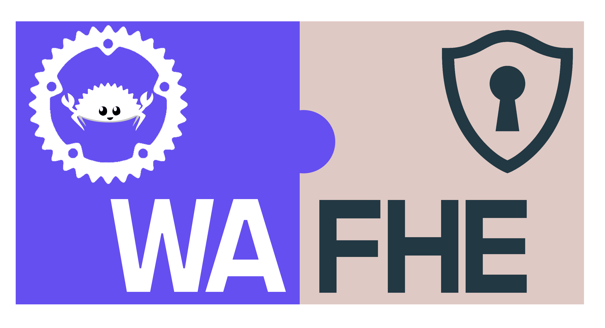
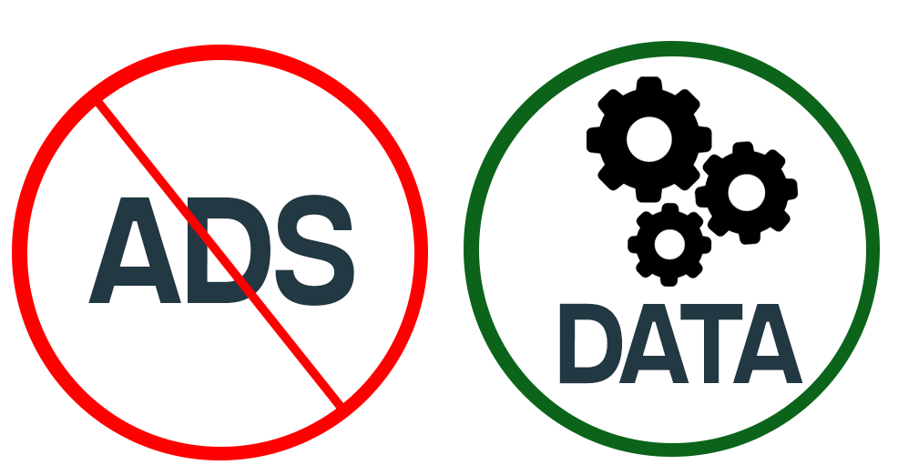

<div id="top"></div>
<!--
*** Thanks for checking out the Best-README-Template. If you have a suggestion
*** that would make this better, please fork the repo and create a pull request
*** or simply open an issue with the tag "enhancement".
*** Don't forget to give the project a star!
*** Thanks again! Now go create something AMAZING! :D
-->

<!-- PROJECT SHIELDS -->
<!--
*** I'm using markdown "reference style" links for readability.
*** Reference links are enclosed in brackets [ ] instead of parentheses ( ).
*** See the bottom of this document for the declaration of the reference variables
*** for contributors-url, forks-url, etc. This is an optional, concise syntax you may use.
*** https://www.markdownguide.org/basic-syntax/#reference-style-links
-->

[![Contributors][contributors-shield]][contributors-url]
[![Forks][forks-shield]][forks-url]
[![Stargazers][stars-shield]][stars-url]
[![Issues][issues-shield]][issues-url]
[![MIT License][license-shield]][license-url]
[![LinkedIn][linkedin-shield]][linkedin-url]

<!-- PROJECT LOGO -->
<br />
<div align="center">
  <a href="https://github.com/othneildrew/Best-README-Template">
    
  </a>

  <h3 align="center">FHE WASM</h3>

  <p align="center">
    A Fully Homomorphic Encryption WebAssembly module written in Rust based on a Rust library for lattice-based additive homomorphic encryption with Typescript bindings
    <br />
    <a href="https://github.com/mihailpreda/fhe-wasm-module"><strong>Explore the docs »</strong></a>
    <br />
    <br />
    ·
    <a href="https://github.com/mihailpreda/fhe-wasm-module/issues">Report Bug</a>
    ·
    <a href="https://github.com/mihailpreda/fhe-wasm-module/issues">Request Feature</a>
    ·
  </p>
</div>

<!-- TABLE OF CONTENTS -->
<details>
  <summary>Table of Contents</summary>
  <ol>
    <li>
      <a href="#about-the-project">About The Project</a>
      <ul>
        <li><a href="#built-with">Built With</a></li>
      </ul>
    </li>
    <li>
      <a href="#getting-started">Getting Started</a>
      <ul>
        <li><a href="#prerequisites">Prerequisites</a></li>
        <li><a href="#installation">Installation</a></li>
      </ul>
    </li>
    <li><a href="#usage">Usage</a></li>
    <li><a href="#roadmap">Roadmap</a></li>
    <li><a href="#contributing">Contributing</a></li>
    <li><a href="#license">License</a></li>
    <li><a href="#contact">Contact</a></li>
    <li><a href="#acknowledgments">Acknowledgments</a></li>
  </ol>
</details>

<!-- ABOUT THE PROJECT -->

## About The Project

 
The goal is to replace the current economic model of websites' monetization. Rather than showing paid ads, that confuse and annoy people, the websites could use some of the processing power of people's devices to make several computation on some chunks of data.

<p align="right">(<a href="#top">back to top</a>)</p>

### Built With

This implementation was possible with the help of certain languages, frameworks and libraries. The main used technologies are :

- [Vue.js](https://vuejs.org/)
- [Rust](https://www.rust-lang.org/)
- [WebAssembly](https://webassembly.org/)
- [wasm-pack](https://rustwasm.github.io/wasm-pack/)
- [Cupcake](https://github.com/facebookresearch/Cupcake)
<p align="right">(<a href="#top">back to top</a>)</p>

<!-- GETTING STARTED -->

## Getting Started

In order to use you just need to [clone](https://github.com/mihailpreda/fhe-wasm-module.git) / [fork](https://github.com/mihailpreda/fhe-wasm-module.git) / [download](https://github.com/mihailpreda/fhe-wasm-module.git) this repository.

### Prerequisites

In order for the library to work you need the following:

_The library is tested on a Vue.js webapp which uses as framework quasar_

- npm
  ```sh
  npm install npm@latest -g
  ```
- quasar
  ```sh
  npm install -g @quasar/cli
  ```

### Installation

_This is a example of installation on a quasar project_

1. Create a quasar project
   ```sh
   quasar create <project_name>
   ```
2. Clone the repo
   ```sh
   git clone https://github.com/mihailpreda/fhe-wasm-module.git
   ```
3. Put into the project `src` folder , the `fhe` folder from repo.
   The project structure of a quasar projects after you insert the `fhe` is as follows:

   ```
   .
   ├── public/                  # pure static assets (directly copied)
   ├── src/
   │   ├── assets/              # dynamic assets (processed by webpack)
   │   ├── components/          # .vue components used in pages & layouts
   │   ├── css/                 # CSS/Sass/... files for your app
   |   |   ├── app.sass
   |   │   └── quasar.variables.sass # Quasar Sass variables for you to tweak
   │(+)├── fhe/                 # <<<<<<<<<<<<<<<<<<<<<<<<<<< fhe module files >>>>>>>>>>>>>>>>>>>>>>>>>>>
   │   ├── layouts/             # layout .vue files
   │   ├── pages/               # page .vue files
   │   ├── boot/                # boot files (app initialization code)
   │   ├── router/              # Vue Router
   |   |   ├── index.js         # Vue Router definition
   |   │   └── routes.js        # App Routes definitions
   │   ├── stores/              # Pinia Stores (if not using Vuex)
   |   |   ├── index.js         # Pinia initialization
   |   │   ├── <store>          # Pinia stores...
   |   │   └── <store>...
   │   ├── store/               # Vuex Store (if not using Pinia)
   |   |   ├── index.js         # Vuex Store definition
   |   │   ├── <folder>         # Vuex Store Module...
   |   │   └── <folder>         # Vuex Store Module...
   │   ├── App.vue              # root Vue component of your App
   │   └── index.template.html  # Template for index.html
   ├── src-ssr/                 # SSR specific code (like production Node webserver)
   ├── src-pwa/                 # PWA specific code (like Service Worker)
   ├── src-cordova/             # Cordova generated folder used to create Mobile Apps
   ├── src-electron/            # Electron specific code (like "main" thread)
   ├── src-bex/                 # BEX (browser extension) specific code (like "main" thread)
   ├── dist/                    # where production builds go
   │   ├── spa/                 # example when building SPA
   │   ├── ssr/                 # example when building SSR
   │   ├── electron/            # example when building Electron
   │   └── ....
   ├── quasar.config.js           # Quasar App Config file
   ├── babel.config.js          # Babeljs config
   ├── .editorconfig            # editor config
   ├── .eslintignore            # ESlint ignore paths
   ├── .eslintrc.js             # ESlint config
   ├── .postcssrc.js            # PostCSS config
   ├── .gitignore               # GIT ignore paths
   ├── package.json             # npm scripts and dependencies
   └── README.md                # readme for your website/App
   ```

4. Add into `quasar.conf.js` in webpack configuration into the `build` property, the following: (immediate after _`chainWebpack(chain){...}`_ )
   ```js
      extendWebpack(cfg) {
        cfg.experiments = {
          asyncWebAssembly: true
        }
      },
   ```
   For better understanding, check this [quasar.conf.js sample](./media/code/quasar.conf.js)

<p align="right">(<a href="#top">back to top</a>)</p>

<!-- USAGE EXAMPLES -->

## Usage

_Example.vue_

```js
<template>
  <q-page> </q-page>
</template>

<script>
import { defineComponent } from "vue";
import getFheModule from "./../fhe/index";

export default defineComponent({
  name: "Example",
  async mounted() {
    const module = await getFheModule();
    const [publicKey, secretKey] = module.generateKeys();

    const plainText1 = new Uint8Array(10).fill(10);
    const encrypted1 = module.encrypt(plainText1, publicKey);
    const add = new Uint8Array(10).fill(5);
    const result1 = module.addConstantToCipher(encrypted1, add);
    const decryptedResult1 = module.decrypt(result1, secretKey);
    console.log("Decrypted addition: 10 + 5 = 15", decryptedResult1);

    const plainText2 = new Uint8Array(10).fill(10);
    const encrypted2 = module.encrypt(plainText2, publicKey);
    const sub = new Uint8Array(10).fill(7);
    const result2 = module.subtractConstantFromCipher(encrypted2, sub);
    const decryptedResult2 = module.decrypt(result2, secretKey);
    console.log("Decrypted subtraction: 10 - 7 = 3", decryptedResult2);

    const plainText3 = new Uint8Array(10).fill(10);
    const encrypted3 = module.encrypt(plainText3, publicKey);
    const mul = 8;
    const result3 = module.multiplyCipherByConstant(encrypted3, mul);
    const decryptedResult3 = module.decrypt(result3, secretKey);
    console.log("Decrypted multiplication: 10 * 8 = 80", decryptedResult3);

    const plainText4 = new Uint8Array(10).fill(20);
    const encrypted4 = module.encrypt(plainText4, publicKey);
    const div = new Uint8Array(10).fill(2);
    const iteration = 5;
    const result4 = module.divideCipherByConstant(encrypted4, div, iteration);
    const decryptedResult4 = module.decrypt(result4, secretKey);
    console.log("Decrypted division v1: 20 / 2 = 10", decryptedResult4);

    const plainText5 = new Uint8Array(10).fill(20);
    const plainText6 = new Uint8Array(10).fill(27);
    const encrypted5 = module.encrypt(plainText5, publicKey);
    const encrypted6 = module.encrypt(plainText6, publicKey);
    const result5 = module.addCiphers(encrypted5, encrypted6);
    const decryptedResult5 = module.decrypt(result5, secretKey);
    console.log(
      "Decrypted addition of 2 cipher texts v1: 20 + 27 = 47",
      decryptedResult5
    );

    const plainText7 = new Uint8Array(10).fill(78);
    const encrypted7 = module.encrypt(plainText7, publicKey);
    const encrypted8 = module.rerandomize(encrypted7, publicKey);
    const result6 = module.decrypt(encrypted7, secretKey);
    const result7 = module.decrypt(encrypted8, secretKey);
    console.log("Rerandomization example:");
    console.log("Initial encrypted values", encrypted7);
    console.log("Rerandozied encrypted values", encrypted8);
    console.log("Decrypted initial encrypted values", result6);
    console.log("Decrypted rerandomized encrypted values", result7);
  },
});
</script>

```

For better understanding, check this [Example.vue sample](./media/code/Example.vue)

<p align="right">(<a href="#top">back to top</a>)</p>

<!-- ROADMAP -->

## Roadmap

- [x] Generate keypair
- [x] Serialization of public key and secret key
- [x] Basic arithmetic operations in range of `u8` (0 - 255) (Add / subtract / multiply / divide by a constant)
- [x] Addition of two different ciphertexts in range of `u8` (0 - 255)
- [x] Re-randomization of a ciphertext
- [ ] Implement basic arithmetic operations for `u16` / `u32` range
- [ ] Implement addition of two different ciphertexts for `u16` / `u32` range

See the [open issues](https://github.com/mihailpreda/fhe-wasm-module/issues) for a full list of proposed features (and known issues).

<p align="right">(<a href="#top">back to top</a>)</p>

<!-- LICENSE -->

## License

Distributed under the MIT License. See [LICENSE.txt](./LICENSE.txt) for more information.

<p align="right">(<a href="#top">back to top</a>)</p>

<!-- CONTACT -->

## Contact

Preda Mihail Irinel - mihaipreda1997@gmail.com

Project Link: [https://github.com/mihailpreda/fhe-wasm-module](https://github.com/mihailpreda/fhe-wasm-module)

<p align="right">(<a href="#top">back to top</a>)</p>

<!-- ACKNOWLEDGMENTS -->

## Acknowledgments

This project is a proof of concept developed for master's thesis and is neither production ready in terms of optimization, nor bug free.

<p align="right">(<a href="#top">back to top</a>)</p>

<!-- MARKDOWN LINKS & IMAGES -->
<!-- https://www.markdownguide.org/basic-syntax/#reference-style-links -->

[contributors-shield]: media/badges/contributors.svg
[contributors-url]: https://github.com/mihailpreda/fhe-wasm-module/contributors
[issues-shield]: media/badges/issues.svg
[issues-url]: https://img.shields.io/github/issues/mihailpreda/fhe-wasm-module?style=for-the-badge
[forks-shield]: media/badges/forks.svg
[forks-url]: https://img.shields.io/github/forks/mihailpreda/fhe-wasm-module?style=for-the-badge
[stars-shield]: media/badges/stars.svg
[stars-url]: https://img.shields.io/github/stars/mihailpreda/fhe-wasm-module?style=for-the-badge
[license-shield]: media/badges/license.svg
[license-url]: https://img.shields.io/github/license/mihailpreda/fhe-wasm-module?style=for-the-badge
[linkedin-shield]: media/badges/linkedin.svg
[linkedin-url]: https://www.linkedin.com/in/mihail-irinel-preda-2327b8195
